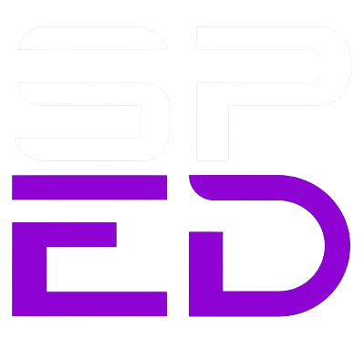

#  SPACED

<div align="center" style="padding: 20px 0" >


</div>

Site desenvolvido usando APIs de astronomia da **NASA**, esse projeto não foi um trabalho da faculdade, apenas uma ideia que eu tive depois que encontrei as **APIs gratuitas** da NASA. Após analisar todos os dados, tive a vontade de desenvolver este site.


<details>
  <summary>  Click here to translate </summary>
  <blockquote>
    <p>This website was developed using NASA's astronomy APIs. It wasn't a college assignment
    just an idea I had after discovering NASA's free APIs. After analyzing the available data, I felt inspired to create this project.</p>
  </blockquote>
</details>


> [!NOTE]
> 
> Todas as **APIs** da **NASA** são de uso livre, mas primeiro você tem que fazer login com seu **EMAIL** no site para receber sua **APIKEY**.

<details>
  <summary>  Click here to translate </summary>
  <blockquote>
    <p>All NASA APIs are free to use, but you must first sign in with your email on their website to receive an API key.</p>
  </blockquote>
</details>

##  Topicos

- [Descrição do Projeto](#descrição-do-projeto)
- [Screenshots Do Projeto](#screenshots-do-projeto)
- [Tecnologias Utilizadas](#tecnologias-utilizadas)
- [Endpoints das APIs](#endpoints-das-apis)
- [Licença](#licença)
- [Contato](#contato)

##  Descrição do Projeto

Assim que todas as funcionalidades do projeto forem definidas, irei atualizar a descrição do projeto.

<details>
  <summary>  Click here to translate </summary>
  <blockquote>
    <p>Once all project features are defined, I will update this section with a complete description.</p>
  </blockquote>
</details>

##  Screenshots do Projeto

🚧 Em Breve será atualizado

<details>
  <summary>  Click here to translate </summary>
  <blockquote>
    <p>🚧 Coming soon</p>
  </blockquote>
</details>

##  Tecnologias Utilizadas

- **Frontend**:

  [](https://skillicons.dev)

- **APIs**:
  
  - Open-Meteo Weather - **Open-Meteo**
  - APOD - **NASA**
  

##  Endpoints das APIs

### 1.  Open-Meteo Weather

**Descrição:**
O Open-Meteo Weather é uma API que fornece dados de previsão do tempo e condições climáticas atuais para uma cidade.
Ela oferece respostas rápidas, suporte a várias coordenadas geográficas e dados meteorológicos precisos sem necessidade de autenticação.

<details>
  <summary>  Click here to translate </summary>
  <blockquote>
    <p>Description: Open-Meteo Weather is an API that provides weather forecasts and current weather conditions for a city. It offers fast responses, supports multiple geographical coordinates, and delivers accurate meteorological data without authentication.</p>
  </blockquote>
</details>

**Endpoint:** ``/forecast``

**Exemplo de Requisição:**
```http
GET https://api.open-meteo.com/v1/forecast?latitude=-23.55&longitude=-46.63&current_weather=true&daily=temperature_2m_max,temperature_2m_min&timezone=America/Sao_Paulo  
```

**Exemplo de Resposta:**
```json
{  
  "latitude": -23.55,  
  "longitude": -46.63,  
  "generationtime_ms": 0.512,  
  "utc_offset_seconds": -10800,  
  "timezone": "America/Sao_Paulo",  
  "timezone_abbreviation": "BRT",  
  "elevation": 760.0,  
  "current_weather": {  
    "temperature": 24.3,  
    "windspeed": 3.6,  
    "winddirection": 150,  
    "weathercode": 3,  
    "time": "2025-02-15T21:09"  
  },  
  "daily": {  
    "time": ["2025-02-15"],  
    "temperature_2m_max": [30],  
    "temperature_2m_min": [19]  
  }  
}  
```

### 2. APOD (  Astronomy Picture of the Day )

**Descrição:**
é uma interface de programação de aplicações (API) desenvolvida pela NASA que fornece diariamente uma imagem astronômica.

<details>
  <summary>  Click here to translate </summary>
  <blockquote>
    <p>Description: This is an application programming interface (API) developed by NASA that provides a daily astronomical image.</p>
  </blockquote>
</details>

**Endpoint:** ``/apod``

**Exemplo de Requisição:**
```http
GET https://api.nasa.gov/planetary/apod
```

**Exemplo de Resposta:**
```json
{
  "date": "2025-02-12",
  "explanation": "What can a space rock tell us about life on Earth?  NASA's OSIRIS-REx spacecraft made a careful approach to the near-Earth asteroid 101955 Bennu in October of 2020 to collect surface samples.  In September 2023, the robotic spaceship returned these samples to Earth.  A recent analysis has shown, surprisingly, that the samples contained 14 out of the 20 known amino acids that are the essential building blocks of life.  The presence of the amino acids re-introduces a big question: Could life have originated in space?  However, the protein building blocks themselves held another surprise -- they contained an even mixture of left-handed and right-handed amino acids -- in contrast to our Earth which only has left-handed ones.  This raises another big question: Why does life on Earth have only left-handed amino acids?  Research on this is sure to continue.",
  "media_type": "video",
  "service_version": "v1",
  "title": "Asteroid Bennu Holds the Building Blocks of Life",
  "url": "https://www.youtube.com/embed/ukCSRYcjSQw?rel=0"
}
```

## 📄 Licença

Este projeto não possui uma licença definida. Sinta-se livre para utilizar e modificar o código conforme necessário.

<details>
  <summary>  Click here to translate </summary>
  <blockquote>
    <p>This project does not have a defined license. Feel free to use and modify the code as needed.</p>
  </blockquote>
</details>

## 📩 Contato

Para dúvidas ou sugestões, entre em contato:

<details>
  <summary>  Click here to translate </summary>
  <blockquote>
    <p>For any questions or suggestions, feel free to reach out:</p>
  </blockquote>
</details>

- **Nome**: Glauedson Carlos Rodrigues
- **Email**: (gluedson18s@gmail.com)