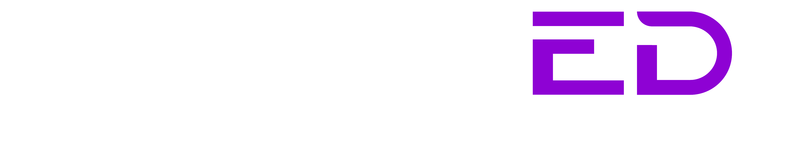

#  SPACED

Site desenvolvido usando APIs de astronomia da **NASA**, esse projeto não foi um trabalho da faculdade, apenas uma ideia que eu tive depois que após descobrir as **APIs gratuitas** da NASA, após analisar todas os dados tive essa vontade de desenvolver esse site.

🛈<strong> Informação</strong> 

Todas as **APIs** da **NASA** são de uso livre, mas primeiro você tem que fazer login com seu EMAIL no site para receber sua **APIKEY**

##  Topicos

- [Descrição do Projeto](#descrição-do-projeto)
- [Screenshots Do Projeto](#screenshots-do-projeto)
- [Tecnologias Utilizadas](#tecnologias-utilizadas)
- [Endpoints das APIs](#endpoints-das-apis)
- [Licença](#licença)
- [Contato](#contato)

##  Descrição do Projeto

Assim que todas funcionalidades do projeto forem definidas, irei atualizar a descrição do projeto

##  Screenshots do Projeto

🚧 Logo será atualizado

##  Tecnologias Utilizadas

🚧 Logo será atualizado

##  Endpoints das APIs

🚧 Logo será atualizado

##  Screenshots do Projeto

🚧 Logo será atualizado

## 📄 Licença

Este projeto não possui uma licença definida. Sinta-se livre para utilizar e modificar o código conforme necessário.

## 📩 Contato

Para dúvidas ou sugestões, entre em contato:

- **Nome**: Glauedson Carlos Rodrigues
- **Email**: (gluedson18s@gmail.com)